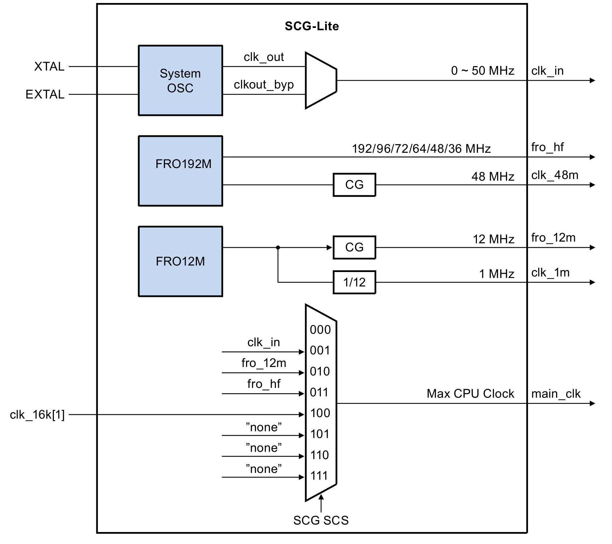
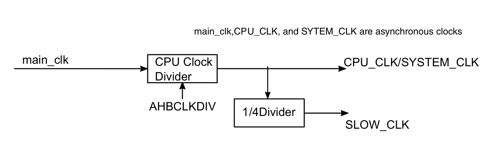

# Core clock

The core clock runs by default at 48 MHz. Want to know why? Keep reading. Otherwise, continue with the next subject.

## Goal

Know why the default core clock frequency of the MCXA153 is 48 MHz.

## Required hardware

- FRDM-MCXA153A board

## Clocking

So far, the following for-loop has been used to create a delay:

```C
// Delay
for(volatile int i=0; i<1000000; i++)
{}
```

This gave a nice visual effect, because the blinking of the LED was not too slow or too fast. A more precise timing would however be preferred and timers are the modules to do so. However, timer modules also have a clock source. So let's first find out at which frequency the MCXA153 microcontroller is running.

The clocking options are depicted in Figure 46 in [chapter 21 of the reference manual](./../docs/datasheets/MCXAP64M96FS3RM.pdf#21%20Clocking).



It shows that:

- There is an external clocking module, called *System OSC*. OSC means OSCilator.
- There are two internal clocking modules, called *FRO192M* and *FRO12M*. FRO means Free Running Oscillator. M means MHz.
- CG means Clock Gating. This is a means to disable that specific clock signal to save power.
- The *main_clk* can be selected from eight inputs, however, only four are implemented. The main_clk is selected in the SCG module by the SCS bits (located in the CSR register).

`?` Find the **SCG->SCR** register in [chapter 22 of the reference manual](./../docs/datasheets/MCXAP64M96FS3RM.pdf#22%20System%20Clock%20Generator%20(SCG)). What is the default value of the SCS bits and what clock is selected?

<details>
<summary>Solution</summary>
```C
// SCS : [011] = FIRC
//
// Referring to 22.1.3 Clock decoder ring, it shows that:
// - SOSC = clk_in
// - SIRC = fro_12m
// - FIRC = fro_hf
// - ROSC = clk_16k[1]
```
</details><br>

So by default, the fro_hf clock is selected for the main_clk. However, the image shows that this can be one of the following frequencies: 192/96/72/64/48/36 MHz. [Paragraph 21.2](./../docs/datasheets/MCXAP64M96FS3RM.pdf#21.2%20Configure%20main%20clock%20and%20system%20clock) states that the fro_hf default frequency is 48 MHz.

Finally, the main_clk can be used to clock the CPU and rest of the system. The CPU Clock Divider, as shown in Figure 48 in [chapter 21 of the reference manual](./../docs/datasheets/MCXAP64M96FS3RM.pdf#21%20Clocking), divides this clock. Figure 48 shows that the AHBCLKDIV register can be used to set the divider value.



`?` Find the AHBCLKDIV register in [chapter 14 of the reference manual](./../docs/datasheets/MCXAP64M96FS3RM.pdf#14%20System%20Controller%20(SYSCON)). What is the default value of the DIV bits and what divider value is selected?

<details>
<summary>Solution</summary>
```C
// DIV : [00000000] = The divider value = (DIV + 1)
```
</details><br>

So by default, the main_clk is divided by 1.

`Conclusion` By default the CPU is clocked with 48 MHz.
