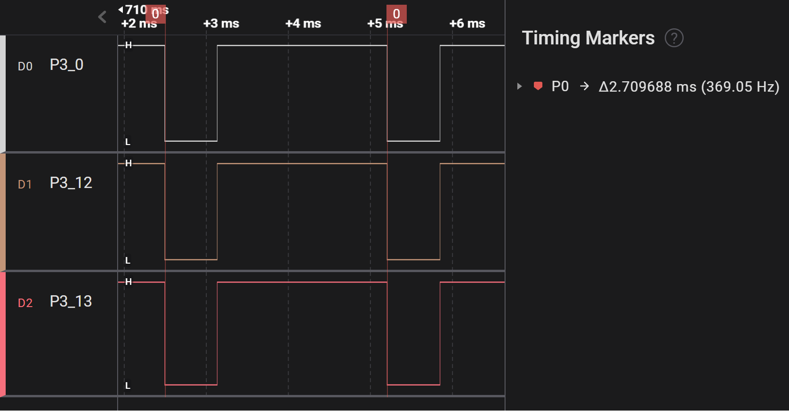
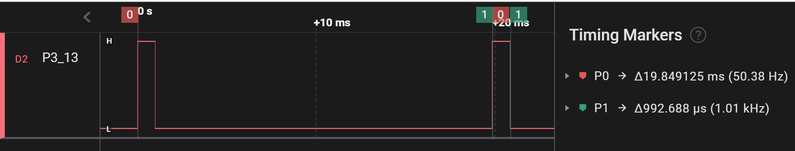

# Flex PWM - edge aligned

## Goal

To know how the FLEXPWM module can be configured to create 16-bit precision edge aligned PWM signals for the RGB LEDs.

## Required hardware

- FRDM-MCXA153A board
- Logic analyzer (optional)

## FLEXPWM features

The MCXA153 has one instance of the FLEXPWM module. It is called PWM0 (or FLEXPWM0). The FLEXPWM is described in the [reference manual chapter 31](./../../docs/datasheets/MCXAP64M96FS3RM.pdf#31%20Enhanced%20Flex%20Pulse%20Width%20Modulator%20(eFlexPWM)).

It is called an *(enhanced) flex* PWM module, because it offers a lot of features (see [reference manual paragraph 31.2.2](./../../docs/datasheets/MCXAP64M96FS3RM.pdf#31%20Enhanced%20Flex%20Pulse%20Width%20Modulator%20(eFlexPWM))). These features allow for the generation of lots of different PWM signals. However, when there are a lot of features involved, often a lot of configuration option must be set correctly before the module is operational.

The FLEXPWM0 module has:

- Three submodules, called SM0, SM1 and SM2.
- Each submodule has three channels: PWM_A, PWM_B and PWM_X.

For creating (simple) edge-aligned PWM signal, all three channels PWM_A, PWM_B and PWM_X can be used. This means potentially a total of 9 PWM signals.

## FLEXPWM channels

`?` Refer to the [board schematic page 7](./../../docs/datasheets/SPF-90829_A1.pdf#page=7). What (FLEX)PWM0 channels are connected to the RGB LED?

<details>
<summary>Solution</summary>
```C
// LED_RED:   P3_12/PWM0_X0 -> FLEXPWM0 channel X from submodule 0
// LED_GREEN: P3_13/PWM0_X1 -> FLEXPWM0 channel X from submodule 1
// LED_BLEU:  P3_0/PWM0_A0  -> FLEXPWM0 channel A from submodule 0
```
</details><br>

*Notice that the LEDs are on by writing logic 0. This means that it will be more convenient to inverse the polarity of the generated PWM signal.*

## FLEXPWM timing registers

There are seven timing related registers involved for each submodule:

- INIT: Start value of the submodule counter.
- VAL1: Modulo (top) value of the submodule counter.
- VAL2: Defines the counter value to set PWM23 (**PWM_A**) high.
- VAL3: Defines the counter value to set PWM23 (**PWM_A**) low.
- VAL4: Defines the counter value to set PWM45 (**PWM_B**) high.
- VAL5: Defines the counter value to set PWM45 (**PWM_B**) low.
- VAL0: Defines the counter value to set PWM_X (**PWM_X**) high. *Can also be used to define the mid-cycle reload point for the PWM.*

The following timing diagram shows the interaction of these registers for edge aligned PWM. Notice how PWM_X is inverted when compared to the other channels. This is because VAL1 is a fixed value, as it sets the modulo (top) value of the counter. This is actual exactly what is needed for an inverted polarity PWM signal. In other words, the PWM_X channel doesn't require changing it's polarity. The other channels, PWM_A and PWM_B, do.

When INIT, VAL2 and VAL4 are equal (0x0000 in the timing diagram) the edges are aligned.

```C

VAL1 (0xFFFF)  - - - - - - - - - - - - - -+- - - - - - - - - - - -+ -
                                         /|                      /|
                                        / |                     / |
                                       /  |                    /  |
                                      /   |                   /   |
                                     /    |                  /    |
VAL0  - - - - - - - - - - - - - - - + - - | - - - - - - - - + - - | -
                                   /.     |                /.     |
                                  / .     |               / .     |
                                 /  .     |              /  .     |
                                /   .     |             /   .     |
                               /    .     |            /    .     |
                              /     .     |           /     .     |
VAL5  - - - - - - - - - - -  + - -  . - - | - - - -  + - -  . - - | -
                            /.      .     |         /.      .     |
                           / .      .     |        / .      .     |
                          /  .      .     |       /  .      .     |
                         /   .      .     |      /   .      .     |
VAL3  - - - - - - - - - +  - . - -  . - - | - - +  - . - -  . - - | -
                       /.    .      .     |    /.    .      .     |
                      / .    .      .     |   / .    .      .     |
                     /  .    .      .     |  /  .    .      .     |
                    /   .    .      .     | /   .    .      .     | /
                   /    .    .      .     |/    .    .      .     |/
INIT (0x0000) ----+-----------------------+-----------------------+--
VAL2 (0x0000)     .     .    .      .     .     .    .      .     .
VAL4 (0x0000)     .     .    .      .     .     .    .      .     .
                  .     .    .      .     .     .    .      .     .
                   _____     .      .      _____     .      .      __
PWM_A           __|     |_________________|     |_________________|
                  .          .      .     .          .      .     .
                  .          .      .     .          .      .     .
                   __________       .      __________       .      __
PWM_B           __|          |____________|          |____________|
                  .                 .     .                 .     .
                  .                 .     .                 .     .
                __                   _____                   _____
PWM_X             |_________________|     |_________________|     |__

```

## FLEXPWM clock source

The clock source for the FLEXPWM module is equal to the main_clk, see reference manual Figure 64. In the example projects, main_clk is set to 48 MHz (unless otherwise noted).

## FLEXPWM initialization of a single channel

The following steps initialize a FLEXPWM single channel:

1. Enable the PORT and FLEXPWM module in the MRCC module.
2. Enable FLEXPWM0 submodule clocks in the SYSCON module.
3. Initialize the pin for PWM function in the PORT3 module.
4. Clear the Load Okay bit in the FLEXPWM register MCTRL.
5. Configure submodule in the FLEXPWMn->SM[x] registers (prescaler, output control, VALn register values, etc.).
6. Set the Load Okay bit in the FLEXPWM register MCTRL.
7. Enable PWM for the submodule in the FLEXPWM register MCTRL.
8. Start the PWM counter for the submodule in the FLEXPWM register MCTRL.

These are quite some steps. The implementation for these steps for the RGB LEDs can be seen here.

<details>
<summary>flexpwm0_init()</summary>
```C
void flexpwm0_init(void)
{
    // FLEXPWM clock source is fixed: main_clk. See reference manual Figure 64
    //(NXP, 2024).

    // Enable modules and leave others unchanged
    // FLEXPWM0: [1] = Peripheral clock is enabled
	// PORT3: [3] = Peripheral clock is enabled
    MRCC0->MRCC_GLB_CC0_SET = MRCC_MRCC_GLB_CC0_FLEXPWM0(1);
    MRCC0->MRCC_GLB_CC1_SET = MRCC_MRCC_GLB_CC1_PORT3(1);

    // Release modules from reset and leave others unchanged
    // FLEXPWM0: [1] = Peripheral is released from reset
    // PORT3: [3] = Peripheral is released from reset
    MRCC0->MRCC_GLB_RST0_SET = MRCC_MRCC_GLB_RST0_FLEXPWM0(1);
    MRCC0->MRCC_GLB_RST1_SET = MRCC_MRCC_GLB_RST1_PORT3(1);

    // Enable FLEXPWM0 submodule clocks
    // CLKn_EN: [1] = Enable
    SYSCON->PWM0SUBCTL |= SYSCON_PWM0SUBCTL_CLK0_EN(1);
    SYSCON->PWM0SUBCTL |= SYSCON_PWM0SUBCTL_CLK1_EN(1);

    // Configure P3_0, P3_12 and P3_13
    // LK : [1] = Locks this PCR
    // INV: [0] = Does not invert
    // IBE: [0] = Input buffer disable
    // MUX: [0101] = Alternative 5
    // DSE: [0] = low drive strength is configured on the corresponding pin,
    //            if the pin is configured as a digital output
    // ODE: [0] = Disables
    // SRE: [0] = Fast
    // PE:  [0] = Disables
    // PS:  [0] = n.a.
    PORT3->PCR[0] = PORT_PCR_LK(1) | PORT_PCR_MUX(5); // PWM0_A0
    PORT3->PCR[12] = PORT_PCR_LK(1) | PORT_PCR_MUX(5); // PWM0_X0
    PORT3->PCR[13] = PORT_PCR_LK(1) | PORT_PCR_MUX(5); // PWM0_X1

    // Clear the Load Okay bit for submodules 0 and 1
    FLEXPWM0->MCTRL |= PWM_MCTRL_CLDOK(0b011);

    // Configure submodule 0
    //
    // PRSC: [001] = Prescaler 2. PWM clock frequency = main_clk / 2
    // FULL: [1] = Full-cycle reloads enabled
    // Rest: default
    FLEXPWM0->SM[0].CTRL = PWM_CTRL_PRSC(0b001) | PWM_CTRL_FULL(1);

    // DBGEN: [1] = When set to one, the PWM continues to run while the chip is
    //              in Debug mode. If the device enters Debug mode and this bit
    //              is zero, then the PWM outputs are disabled until Debug mode
    //              is exited. At that point, the PWM pins resume operation as
    //              programmed in the PWM registers
    // INDEP: [1] = PWM_A and PWM_B outputs are independent PWMs
    // Rest: default
    FLEXPWM0->SM[0].CTRL2 = PWM_CTRL2_INDEP(1) | PWM_CTRL2_DBGEN(1);

    // POLA: [1] = PWM_A output inverted. A low level on the PWM_A pin
    //             represents the "on" or "active" state
    // POLX: [0] = Default value. Do not invert polarity for PWM_X, because
    //             active state is controlled by VAL0
    // Rest: default
    FLEXPWM0->SM[0].OCTRL = PWM_OCTRL_POLA(1);

    // DISA: [0000] = Disable fault handling
    // DISX: [0000] = Disable fault handling
    FLEXPWM0->SM[0].DISMAP[0] &= ~(PWM_DISMAP_DIS0A_MASK);
    FLEXPWM0->SM[0].DISMAP[0] &= ~(PWM_DISMAP_DIS0X_MASK);

    // Edge aligned PWM. See reference manual paragraph 31.3.2.2 (NXP, 2024).
    FLEXPWM0->SM[0].INIT = 0;
    FLEXPWM0->SM[0].VAL0 = 0;
    FLEXPWM0->SM[0].VAL1 = 0xFFFF;
    FLEXPWM0->SM[0].VAL2 = 0;
    FLEXPWM0->SM[0].VAL3 = 0;
    FLEXPWM0->SM[0].VAL4 = 0;
    FLEXPWM0->SM[0].VAL5 = 0;

    // Configure submodule 1
    //
    // PRSC: [001] = Prescaler 2. PWM clock frequency = main_clk / 2
    // FULL: [1] = Full-cycle reloads enabled
    // Rest: default
    FLEXPWM0->SM[1].CTRL = PWM_CTRL_PRSC(0b001) | PWM_CTRL_FULL(1);

    // DBGEN: [1] = When set to one, the PWM continues to run while the chip is
    //              in Debug mode. If the device enters Debug mode and this bit
    //              is zero, then the PWM outputs are disabled until Debug mode
    //              is exited. At that point, the PWM pins resume operation as
    //              programmed in the PWM registers
    // INDEP: [1] = PWM_A and PWM_B outputs are independent PWMs
    // Rest: default
    FLEXPWM0->SM[1].CTRL2 = PWM_CTRL2_INDEP(1) | PWM_CTRL2_DBGEN(1);

    // POLX: [0] = Default value. Do not invert polarity for PWM_X, because
    //             actve state is controlled by VAL0
    // Rest: default

    // DISX: [0000] = Disable fault handling
    FLEXPWM0->SM[1].DISMAP[0] &= ~(PWM_DISMAP_DIS0X_MASK);

    // Edge aligned PWM. See reference manual paragraph 31.3.2.2 (NXP, 2024).
    FLEXPWM0->SM[1].INIT = 0;
    FLEXPWM0->SM[1].VAL0 = 0;
    FLEXPWM0->SM[1].VAL1 = 0xFFFF;
    FLEXPWM0->SM[1].VAL2 = 0;
    FLEXPWM0->SM[1].VAL3 = 0;
    FLEXPWM0->SM[1].VAL4 = 0;
    FLEXPWM0->SM[1].VAL5 = 0;
    
    // Load prescaler, modulus, and PWM values of the submodules 0 and 1
	FLEXPWM0->MCTRL |= PWM_MCTRL_LDOK(0b011);

    // PWMA_EN: [001] = Enable PWM_A for submodule 0
    // PWMX_EN: [011] = Enable PWM_X for submodule 0 and submodule 1
    FLEXPWM0->OUTEN |= PWM_OUTEN_PWMA_EN(0b001) | PWM_OUTEN_PWMX_EN(0b011);

    // PWM counter is started in the submodules 0 and 1
	FLEXPWM0->MCTRL |= PWM_MCTRL_RUN(0b011);
}
```
</details><br>

## PWM frequency

One thing we haven't paid attention to so far, is the resulting PWM frequency. In order to calculate the PWM frequency, the following must be know:

- The value of the FLEXPWM0 source clock. This is always main_clk (48 MHz).
- The value of the submodule prescaler.
- The value of the submodule modulo (top).

The PWM frequency is then calculated by:

```C
submodule_pwm_frequency = (main_clk / submodule_prescaler) / (submodule_modulo + 1) Hz
```

`?` Carefully review the above function flexpwm0_init(). For submodule 0, what is the selected prescaler and what is the modulo value?

<details>
<summary>Solution</summary>
```C
// Configuration summary
//
// main_clk = 48 MHz
// submodule_0_prescaler = 2
// submodule_0_count_frequency = 48 MHz / 2 = 24 MHz
// submodule_0_modulo_value = VAL1 = 0xFFFF
// submodule_0_pwm_frequency = count_frequency / (VAL1 + 1)
//                           = 24 MHz / 65536
//                           = 366.21 Hz
// submodule_0_duty_cycle: from 0 to VAL1
```
</details><br>


## Changing the duty cycle

Changing the duty cycle for a channel takes the following steps:

1. Clear the Load Okay bit for the submodule in the FLEXPWM register MCTRL.
2. Write the updated duty cycle to the VAL0 (for PWM_X), VAL3 (for PWM_A) or VAL5 (for PWM_B) register.
3. Load prescaler, modulus, and PWM values for the submodule in the FLEXPWM register MCTRL.

Here is an example for the red LED.

<details>
<summary>flexpwm0_set_red()</summary>
```C
inline void flexpwm0_set_red(const uint16_t duty_cycle)
{
    // LED_RED: P3_12/PWM0_X0

    // Clear the Load Okay bit for submodule 0
    FLEXPWM0->MCTRL |= PWM_MCTRL_CLDOK(0b001);

    // Set duty cycle
    FLEXPWM0->SM[0].VAL0 = duty_cycle;

    // Load prescaler, modulus, and PWM values of the submodule 0
    FLEXPWM0->MCTRL |= PWM_MCTRL_LDOK(0b001);
}
```
</details><br>

## Test and verification

- Open the project flexpwm_edge_aligned.
- Build and run the application.
- Verify that the brightness of the green LED is increasing.

*For reference, this is what the generated PWM signal with all channels enabled looks like with a logic analyzer:*



## Final assignment

A servo motor typically requires a PWM frequency of 50 Hz and a duty cycle between 1 and 2 ms. For example for P3_13/PWM0_X1:



1. What are suitable values for the *prescaler* and *modulo (top)* (given that main_clk = 48 MHz) for generating such a servo PWM signal?
2. What match value is equal to a duty cycle of 1 ms?

<details>
<summary>Solution</summary>

The submodule PWM frequency is calculated as follows:

```C
submodule_pwm_frequency = (main_clk / submodule_prescaler) / (submodule_modulo + 1) Hz
```

Rewritten:

```C
(submodule_modulo + 1) = (main_clk / submodule_prescaler) / submodule_pwm_frequency
```

Substituting known values:

```C
(submodule_modulo + 1) = (48 MHz / 2) / 50 Hz = 480000
```

Problem: this value of 480000 is too high to fit in a 16-bit register!
Solution: to increase the submodule_prescaler value so the submodule_modulo value can be decreased.

Rewriting the equation above gives:

```C
submodule_prescaler = (main_clk) / ((submodule_modulo + 1) * submodule_pwm_frequency)
```

With a maximum submodule_modulo value the minimum submodule_prescaler can be calculated.
Substituting known values:

```C
submodule_prescaler = (48 MHz) / (65536 * 50) = 14.65
```

The closest next available submodule_prescaler is 16. This would give an actual submodule_modulo value of:

```C
(submodule_modulo + 1) = (48 MHz / 16) / 50 Hz = 60000
```

In other words: the submodule_modulo value of 60000 is equal to a period of 1/(50 Hz) = 20 ms.

A duty cycle of 1 ms is therefore equal to a match value of:

```C
60000 / 20 = 3000
```
</details><br>

Implement these values in the function flexpwm0_init() for P3_13/PWM0_X1. Test and verify the generated signal with a logic analyzer.
