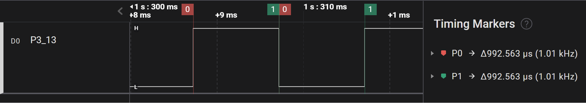

# SysTick

## Goal

To know what the SysTick module is and how to use the SysTick module for generating interrupts at a fixed interval.

## Required hardware

- FRDM-MCXA153A board
- Logic analyzer (optional)

## System Tick Timer

The Cortex-M33 core comes with an integrated timer module, called the [System Tick Timer (SysTick)](https://developer.arm.com/documentation/100235/0004/the-cortex-m33-peripherals/system-timer--systick). This timer is often used by operating systems (OS), because this very same module is available in all Cortex-M microcontrollers. For applications that do not require an OS, the SysTick can be used for time keeping, time measurement, or as an interrupt source for tasks that need to be executed regularly.

Characteristics of the Cortex-M33 SysTick timer are:

- 24-bit down counter
- Clocked by the CPU_CLK
- The interrupt controller clock updates the SysTick counter. If this clock signal is stopped for low-power mode, the SysTick counter stops.

## Accessing the SysTick module

The registers of the SysTick module are memory mapped. Clearing the CTRL register, for example, can be done as follows:

```C
SysTick->CTRL = 0;
```

However, [CMSIS](https://www.keil.com/pack/doc/CMSIS_Dev/Core/html/group__SysTick__gr.html) provides a universal function to configure the SysTick module for all Cortex-M devices. The function prototype is:

```C
uint32_t SysTick_Config(uint32_t ticks);
```

## Verification of the default CPU clock setting

By default, the CPU is clocked with a frequency of 48 MHz. This means the SysTick timer is also clocked with 48 MHz. If we were to generate an interrupt every second, the CMSIS function would be called as follows:

```C
SysTick_Config(48000000);
```

However, 2^24 < 480000000, so this will not work. The CMSIS function SysTick_Config() checks if the parameter `ticks` is within the 24-bit range. If not, the SysTick timer will not be started.

Instead of generating interrupts every second, let's generate an interrupt every millisecond.

`?` What would be the value of the `ticks` parameter?

<details>
<summary>Solution</summary>
```C
// Generate an interrupt every 1 ms
SysTick_Config(48000);
```
</details><br>

Interrupts are disable by default and can be enabled by using the CMSIS compliant function:

```C
// Enable interrupts
__enable_irq();    
```

In this example, the while-loop will be empty. With the Wait For Interrupt (WFI) instruction, the microcontroller can be put into a sleep mode.

```C
while(1)
{
    // Wait for interrupt
    __WFI();
} 
```

Finally, an interrupt handler is required. The CMSIS compliant function name is SysTick_Handler(). This name can also be found in the vector table in the startup file.

```C
void SysTick_Handler(void)
{
    // Toggle the green LED
    GPIO3->PTOR = (1<<13);
}
```

## Test and verification

- Open the project systick.
- Build and run the application.
- Verify that the green LED is on. The frequency is too high for the human eye to see the LED blinking. Connecting a logic analyzer to P3_13 shows:



This is very close to the expected 1 ms pulse width.

## Final assignment

- In main.c, add a global variable called `ms` as follows:

```C
static volatile uint32_t ms = 0;
```

- Update the SysTick_Handler() as follows:

```C
void SysTick_Handler(void)
{
    ms++;
    
    if((ms % 1000) == 0)
    {
        // Toggle the green LED
        GPIO3->PTOR = (1<<13);
    }
}
```

- Build and run the application. Explain the result.

<details>
<summary>Solution</summary>
The green LED blinks with a frequency of 1 Hz. The modulo operator is used to check if the variable is a multiple of 1000.
</details><br>

- `ms` is an 32-bit unsigned variable. How many days can be recorded if this variable is incremented every millisecond, before it starts from zero again?

<details>
<summary>Solution</summary>
(2^32)-1 ms = 4294967295 ms ~= 1193 h ~= 49.7 days
</details><br>
