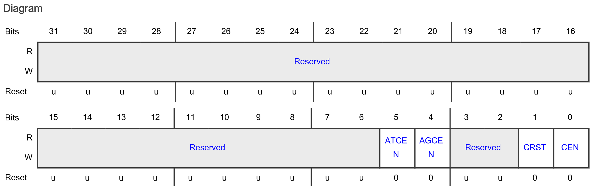

# CMSIS

## Goal

To understand what the CMSIS is and how bits are manipulated in registers in C 
by using CMSIS.

## Required hardware

- None

## Introduction

This course aims at teaching how to program the modules of the microcontroller directly through its registers, instead of using driver functions. This will be achieved by making use of the Common Microcontroller Software Interface Standard (CMSIS). One subject of this standard is the [naming convention](https://www.keil.com/pack/doc/CMSIS/Core/html/group__peripheral__gr.html) for accessing modules. Microcontroller vendors offer CMSIS compliant header and source files that can be added to a project, which is often automated when creating a new project in the SDE of choice. The benefit of using this naming convention is that accessing registers of peripherals in C is done by simple statements. Most microcontroller vendors use names that are also used in their reference manual and/or datasheet.

The CMSIS naming convention for accessing modules is:

```C
MODULE->REGISTER
```

For example, setting the CTRL register in the SysTick module to zero is done as follows:

```C
SysTick->CTRL = 0;
```

## Memory mapped IO

All registers in an ARM Cortex-M microcontroller are memory mapped. This
means that every registers is located at a 32-bit address. For example, 
the SySTick->CTRL register in the MCXA153 microcontroller is located at 
address 0xE000E010. Writing a 32-bit number to this 32-bit address in C
can be done as follows:

```C
*((volatile uint32_t *)(0xE000E010)) = 0;
```

This is both unreadable and not portable.

Within the SysTick module, more than one registers exists. These register
are conveniently grouped in memory. CMSIS takes advantage of the fact that
a struct in C is a way to group variables. The registers memory layout of 
the SysTick module can therefore be represented as a struct:

```C
typedef struct
{
  __IOM uint32_t CTRL;   /*!< Offset: 0x000 (R/W)  SysTick Control and Status Register */
  __IOM uint32_t LOAD;   /*!< Offset: 0x004 (R/W)  SysTick Reload Value Register */
  __IOM uint32_t VAL;    /*!< Offset: 0x008 (R/W)  SysTick Current Value Register */
  __IM  uint32_t CALIB;  /*!< Offset: 0x00C (R/ )  SysTick Calibration Register */
} SysTick_Type;
```

The base address in memory of this struct will be the address of the first field in the struct, being the CTRL 
register in this example. And the address of the CTRL register is known, because this is described
in the reference manual (or in this case the ARMv8-M documentation, because 
this is a core register). A more meaningful name for the base address of the 
module is defined as follows:

```C
#define SysTick ((SysTick_Type *) 0xE000E010 )
```

*This means: SysTick is a pointer pointing to a SysTick_Type struct at address 0xE000E010.*

Accessing one of the fields can thus be achieved by using the pointer to a struct 
dereference operator: `->`

For example:

```C
SysTick->CTRL = 0;
```

Cortex-M microcontroller vendors offer comprehensive header files for
their devices with CMSIS compliant defines for all the modules and registers.

## Bit manipulation

Bits in register are manipulated with the C bitwise operators as follows:

```C
// Set bits in a register and leave all others unchanged
MODULE->REGISTER |= (0x00010001);
```

```C
// Clear bits in a register and leave all others unchanged
MODULE->REGISTER &= ~(0x00010001);
```

```C
// Toggle bits in a register and leave all others unchanged
MODULE->REGISTER ^= (0x00010001);
```

## Bit field masks

Instead of using magic numbers (such as 0x00010001 in the example above), CMSIS 
also provides a convention for accessing bit fields in a register. The convention 
describes the following three defines for each bit field:

```C
// A 32-bit mask with logic 1s at every location of the bit field
MODULE_REGISTER_BITFIELD_MASK

// The bit position of the LSB of the bit field
MODULE_REGISTER_BITFIELD_SHIFT

// A macro to shift the number x to the bit fields location in the register.
// The macro also makes sure that if an invalid number is written (i.e. too
// large for the bit field), all bits outside the bit field boundary are 
// set to logic 0.   
MODULE_REGISTER_BITFIELD(x)
```

Now have a look TCR register diagram taken from the reference manual.



And these are the defines for the CEN bit field in the TCR register:

```C
#define CTIMER_TCR_CEN_MASK   (0x1U)
#define CTIMER_TCR_CEN_SHIFT  (0U)             
#define CTIMER_TCR_CEN(x)     (((uint32_t)(((uint32_t)(x)) << CTIMER_TCR_CEN_SHIFT)) & CTIMER_TCR_CEN_MASK)
```

Finally, several examples of how to these defines can be used.

```C
// Set the CEN bit field in the TCR register in the CTIMER1 module and leave
// all other bits unchanged. Notice that all three instructions have the same
// result!
CTIMER1->TCR |= CTIMER_TCR_CEN(1);
CTIMER1->TCR |= (1 << CTIMER_TCR_CEN_SHIFT);
CTIMER1->TCR |= CTIMER_TCR_CEN_MASK;

// Set the LK bit field in PCR 0 register of PORT3 and reset all other bits!
PORT3->PCR[0] = PORT_PCR_LK(1);

// Set the PCS bit field in the PSR register of LPTMR0 module to 3 and reset 
// all others!
LPTMR0->PSR = LPTMR_PSR_PCS(0b11);

// Check if the TDRE bit field in the STAT register of the LPUART0 module is
// not equal to zero.
if((LPUART0->STAT & LPUART_STAT_TDRE_MASK) != 0)

// Check if the BBF bit field or the MBF bit field in the MSR register of the 
// LPI2C module is not equal to zero.
while((LPI2C0->MSR & (LPI2C_MSR_BBF_MASK | LPI2C_MSR_MBF_MASK)) != 0)
```