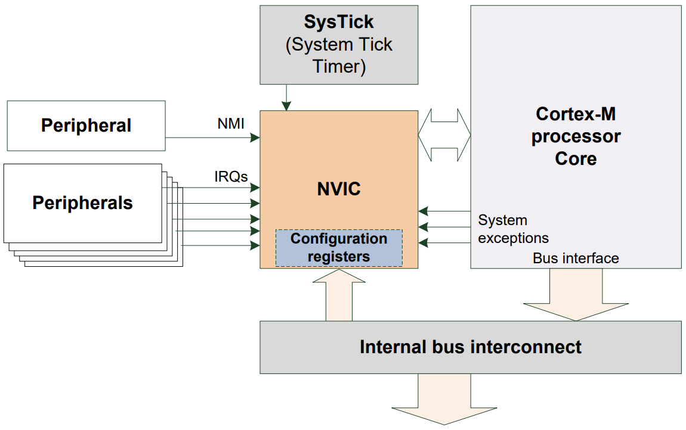
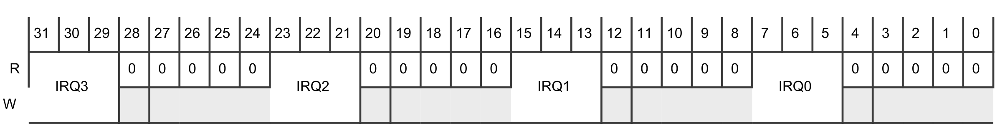

# NVIC

## Goal

To understand how the NVIC handles interrupts and use CMSIS to configure the NVIC.

## Required hardware

- None

## Introduction

The Nested Vectored Interrupt Controller (NVIC) handles the priority management and masking of interrupts and exceptions. The NVIC is closely coupled with the core as depicted and described in this [white paper](./../docs/datasheets/White%20Paper%20-%20Cortex-M%20for%20Beginners%20-%202016%20(final%20v3).pdf#page=5):



Each interrupt can be in one of the following states:

- Inactive
> *The interrupt is not active and not pending*
- Active
> *Indicates that this interrupt is being serviced*
- Pending
> *Indicates that an interrupt is waiting to be serviced.*
- Active and pending at the same time
> *The interrupt is being serviced by the core and there is a pending exception from the same source*

## Nesting

The N in NVIC stands for **nested**. Nested in the context of microcontrollers means that the handling of one interrupt service handler can be interrupted by another interrupt. For example:

```txt
main   isr1   isr2
---    ---    ---
 |      .      .
 |      .      .
 +----->+      .    -> isr1 is triggered and starts executing
 .      |      .
 .      +----->+    -> isr2 is triggered and pre-empts isr1
 .      .      |
 .      +<-----+    -> isr2 is finished and isr1 continues
 .      |      .
 +<-----+      .    -> isr1 is finished and main continues
 |      .      .
 |      .      .
```

Interrupting another interrupt handler is only possible if the latter interrupt has higher priority. The [reference manual section 3.3](./../docs/datasheets/MCXAP64M96FS3RM.pdf#3.3%20Nested%20Vectored%20Interrupt%20Controller%20(NVIC)) describes that the MCXA153 supports 8 interrupt priority levels. These 8 levels are recorded in three bits. For the first four IRQ numbers, this is recorded in Interrupt Priority Register 0 (IPR0) as follows:



As can be seen in the image, each priority level is recorded in the MSB three bits of a byte. This results in the following priority levels in binary and decimal notation:

```txt
0b_000_00000 :   0  -> highest priority
0b_001_00000 :  32
0b_010_00000 :  64
0b_011_00000 :  96
0b_100_00000 : 128
0b_101_00000 : 160
0b_110_00000 : 192
0b_111_00000 : 224  -> lowest priority
```

## Vector

The V in NVIC stands for **vectored**. Vectored in the context of microcontrollers means that the addresses of the interrupt handlers are stored in a table. In other words, this table stores function pointers (a.k.a. vectors) to the interrupt handlers. As soon as an interrupt is triggered, the microcontroller finds the corresponding address in this table and starts executing the interrupt handler.

The index of an address in this table is also know as the interrupt number (IRQn). The implementation of the entire vector table for the MCXA153 is given in the [reference manual](./../docs/datasheets/MCXAP64M96FS3RM.pdf) in an appendix. An example of a (partial) vector table from one of the example projects is as follows:

```txt
IRQn   Memory       Memory     Description
       address      content
---  -----------  -----------  ------------------------------------
         ...          ...      
         ...          ...      
     0x0000_057C  0x0110_F2C4  Next instruction of SysTick_Handler
     0x0000_0578  0x014C_F245  First instruction of SysTick_Handler
         ...          ...      
         ...          ...                                          
     0x0000_0218  0x6001_4907  Next instructions of startup
     0x0000_0214  0x4807_B672  First instructions of startup
         ...          ...                                          
         ...          ...      
---  -----------  -----------  ------------------------------------
 79  0x0000_017C  0x0000_039C  Reserved95_IRQHandler
         ...          ...      
         ...          ...      
  2  0x0000_0048  0x0000_0268  DMA_CH0_IRQHandler
  1  0x0000_0044  0x0000_0264  CMC_IRQHandler
  0  0x0000_0040  0x0000_0260  Reserved16_IRQHandler
     -----------  -----------  ------------------------------------
 -1  0x0000_003C  0x0000_0578  SysTick_Handler
         ...          ...                                          
         ...          ...      
-13  0x0000_000C  0x0000_0250  HardFault_Handler
-14  0x0000_0008  0x0000_024C  NMI_Handler
     0x0000_0004  0x0000_0214  Reset_Handler
     0x0000_0000  0x2000_6000  Top of the stack
```

Use the NVIC_configuration.xlsx appendix in the reference manual.

*`Q1` What is the IRQn (NVIC Interrupt ID) of the GPIO1 module?*

The vector table is created by the linker and (normally) stored at the beginning of the flash memory. This is achieved in the examples in the startup file. This startup file uses placeholder names for all interrupt handlers. These are declared with the *weak* symbol, to denote that if the programmer doesn't provide an interrupt handler, the placeholder implementation should be used.

## Special cases of interrupt priority

The NVIC will handle special priority cases as follows:

- New interrupt requested while an interrupt handler is executing?
    - New priority higher than current priority? 
        - New interrupt handler **pre-empts** current interrupt handler
    - New priority lower than or equal to current priority? 
        - New interrupt held in **pending** state
        - Current handler continues and completes execution
        - Previous priority level restored
        - New interrupt handled if priority level allows
- Simultaneous interrupt requests and the same priority?
    - Lowest interrupt IRQn is serviced first

## CMSIS

The NVIC can be read and written by using its registers, similar to all other modules in the microcontroller. However, the NVIC is a module that is available in all Cortex-M microcontrollers. For that reason the CMSIS provides [functions to access the NVIC](https://www.keil.com/pack/doc/CMSIS/Core/html/group__NVIC__gr.html#details).

Some functions that are often used are:

```C
// Enable a device specific interrupt.
void NVIC_EnableIRQ(IRQn_Type IRQn);

// Set the priority for an interrupt.
void NVIC_SetPriority(IRQn_Type IRQn, uint32_t priority);

// Clear a device specific interrupt from pending.
void NVIC_ClearPendingIRQ(IRQn_Type IRQn);

// Globally enables interrupts.
void __enable_irq();

// Globally disables interrupts.
void __disable_irq();
```

Microcontroller vendors offer an enumerated type for the IRQn's. So instead of writing

```C
void NVIC_EnableIRQ(31);
```

for enabling LPUART0 interrupts, the following can be used:

```C
void NVIC_EnableIRQ(LPUART0_IRQn);
```

Setting the priority of an IRQn can be done in two ways:

1. Directly by writing to the IPRn registers.
2. By using the CMSIS function *NVIC_SetPriority()*.

There is a difference, because the the CMSIS function assumes a priority value from 0 to 7. Whereas the IPRn registers should have a value as mentioned above. In other words, the following instructions have the same result:

```C
NVIC_SetPriority(GPIO1_IRQn, 3);

NVIC->IPR[GPIO1_IRQn] = 96;
```

*`Q2` What happens if the following instruction is executed?*

```C
NVIC_SetPriority(GPIO1_IRQn, 96);
```

## ISR considerations

When writing ISR's it is good practice to:

- Clear an interrupt in both the NVIC and module.
- Keep code as short as possible in the ISR.
- Declare global variables **volatile** that are used in the ISR to prevent the compiler from optimization.

## Answers

### Q1

72

### Q2

In order to answer this question, a closer look must be taken into the implementation of the NVIC_SetPriority() function (see the file CMSIS/Core/Include/core_cm33.h included in all projects).

```C
/**
  \brief   Set Interrupt Priority
  \details Sets the priority of a device specific interrupt or a processor exception.
           The interrupt number can be positive to specify a device specific interrupt,
           or negative to specify a processor exception.
  \param [in]      IRQn  Interrupt number.
  \param [in]  priority  Priority to set.
  \note    The priority cannot be set for every processor exception.
 */
__STATIC_INLINE void __NVIC_SetPriority(IRQn_Type IRQn, uint32_t priority)
{
  if ((int32_t)(IRQn) >= 0)
  {
    NVIC->IPR[((uint32_t)IRQn)]               = (uint8_t)((priority << (8U - __NVIC_PRIO_BITS)) & (uint32_t)0xFFUL);
  }
  else
  {
    SCB->SHPR[(((uint32_t)IRQn) & 0xFUL)-4UL] = (uint8_t)((priority << (8U - __NVIC_PRIO_BITS)) & (uint32_t)0xFFUL);
  }
}
```

For the MCXA153, __NVIC_PRIO_BITS is defined as 3. This means the provided priority will be bitwise left shifted 8 - 3 = 5 positions.
With a value of 96 (=0b01100000), this means: (0b01100000 << 5) = 0b00000000.

The result is that the priority will be set to 0, which is the highest priority.
